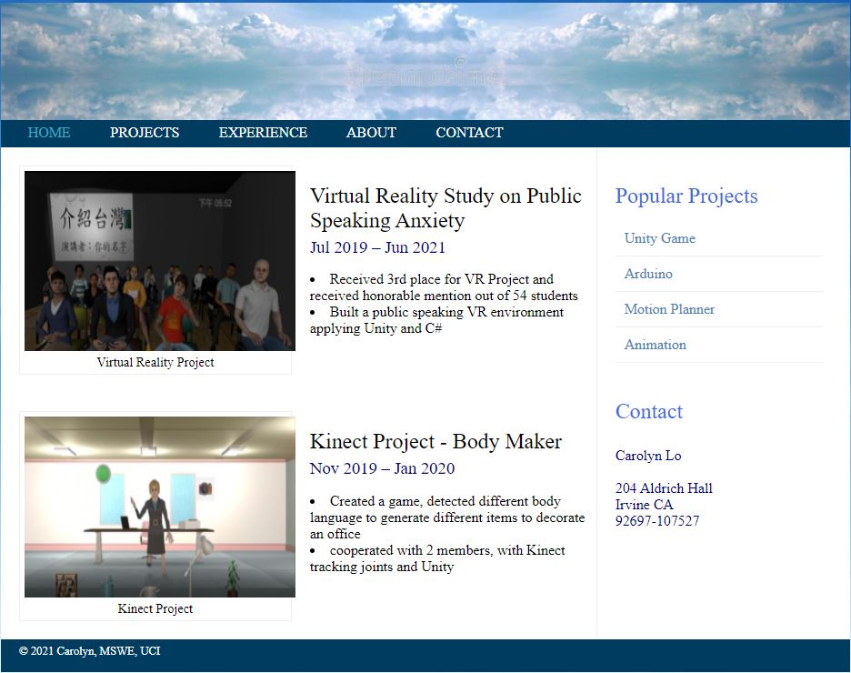

## Objective:

Develop your first web server using Node.js and NPM, learn how to work with these important tools of the modern web stack, have your first web server up and running. Use the web server that you created locally to serve a very simple, single-page webpage, and describe and report what you have done. The aim is for you to start understanding how a simple web server works and get acquainted with Node.js so that you will be able to use it in your future work and during this course.

Using the relevant partial codes from Chapters 1 and 2 of the textbook, create codes by your own that will allow you to have a simple web server up and running and serving the webpage that you created in the first assignment.

## The browser
Google Chrome

## Browser version
95.0.4638.69

## Operating system
Windows 10 (version: 21H1)

## Computer architecture
CPU: Intel(R) Core(TM) i5-6200U CPU @ 2.30GHz   2.40 GHz
RAM: 12.0 GB

## Description
google chrome is a famous brower, so when I successfully open in google chrome and see the correct website, I make sure that it would work for the majority of the users.

## Result

