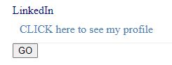

## Objective
Add some React components to your webpage based on the codes from Chapters 3 and 4 of the textbook. The aim is for you to get acquainted with React and how React can be used to improve significantly the user experience in more complex web applications - as you will be developing later in this course.

Using the relevant partial codes from Chapter 3 and 4 of the textbook, either modify the web page that you developed in the first assignment so you can add React components or create a new web page from scratch to demonstrate your React understanding.

## The browser
Google Chrome

## Browser version
95.0.4638.69

## Operating system
Windows 10 (version: 21H1)

## Computer architecture:
CPU: Intel(R) Core(TM) i5-6200U CPU @ 2.30GHz   2.40 GHz
RAM: 12.0 GB

## Description
Google chrome is a famous brower, so when I successfully open in google chrome and see the correct website, I make sure that it would work for the majority of the users.

## React features
Add a buttom. If users clicked the buttom, the website shows the words and a link to my linkedin profile.

## Result

