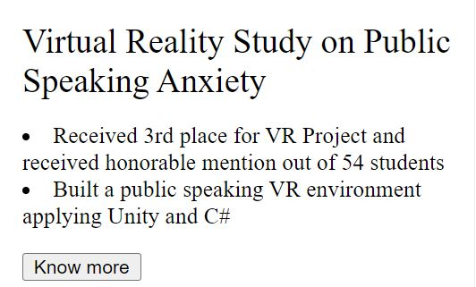

## Objective
Objective: Read, reproduce line-by-line, execute, and understand the code from Chapter 5 of the textbook. The aim is for you to learn the basics of TypeScript, which is an important modern language for web development that is becoming each time more popular in the web industry.

From Chapter 5 of the textbook, make sure to reproduce all the codes. Create a small webpage or modify the webpage that you have been developing throughout this course to demonstrate that you understand how to write simple TypeScript code. Your webpage can be about anything, as long as it is fully functional and that it includes TypeScript elements. Make sure to use arrow functions and some classes also.

## The browser
Google Chrome

## Browser version
95.0.4638.69

## Operating system
Windows 10 (version: 21H1)

## Computer architecture:
CPU: Intel(R) Core(TM) i5-6200U CPU @ 2.30GHz   2.40 GHz
RAM: 12.0 GB

## Description
Google chrome is a famous brower, so when I successfully open in google chrome and see the correct website,
I make sure that it would work for the majority of the users.

## TypeScript features

I add two buttons, when users click the buttons, the program calls the function.
In the typescript funtion,
it pass the paremeters(project name) and use Project Class and arrow function to get the date fo the project name,
then changes the innerHTML element adn shows the date on the website.

## Result

